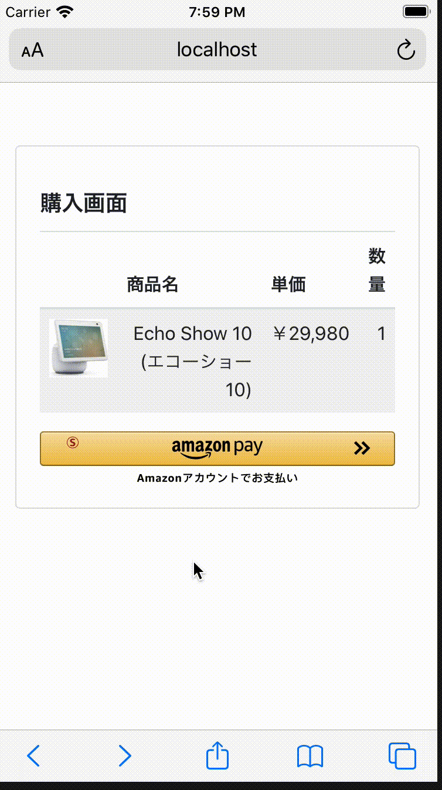

# Ruby版 Amazon Pay v2 サンプルアプリケーション
下記Amazon Pay v2の、Ruby版サンプルアプリケーションです。  
http://amazonpaycheckoutintegrationguide.s3.amazonaws.com/amazon-pay-checkout/introduction.html

## 動作環境
Ruby 2.3.0 以上  
Note: 2.5.0 未満の場合、「openssl」のGemを下記指示にしたがって更新する必要があります。  
https://github.com/ruby/openssl  

## 概要
本アプリケーションでは、下記のようにAmazon Payでの単純な購入フローを実行するサンプルを提供しています。  

  

## インストール

### リポジトリのclone
本リポジトリをcloneします。  
```sh
git clone https://github.com/amazonpay-labs/amazonpay-sample-ruby-v2.git

# cloneしたリポジトリへ移動
cd amazonpay-sample-ruby-v2
```

### Seller Centralでのアプリケーション作成・設定
下記コマンドにて、Rubyスクリプトを実行します。  
```sh
ruby keys/init.rb
```

keysディレクトリ配下に、下記のファイルが生成されます。  
  - keyinfo.rb  
  - privateKey.pem  

[Seller Central](https://sellercentral.amazon.co.jp/)にて、本サンプル用にアプリケーションを用意し、[こちら](https://amazonpaycheckoutintegrationguide.s3.amazonaws.com/amazon-pay-checkout/get-set-up-for-integration.html#4-get-your-public-key-id)を参考に、Merchant ID, Public Key ID, Store ID, Private Keyを取得し、それぞれ下記にコピーします。
  * Merchant ID: keys/keyinfo.rb の merchant_id
  * Public Key ID: keys/keyinfo.rb の public_key_id
  * Store ID: keys/keyinfo.rb の store_id
  * Private Key: keys/privateKey.pem

### 依存モジュールのインストール
本ディレクトリにて、下記のコマンドを実行して依存モジュールをインストールします。

#### Bundlerを使用する場合
```sh
bundle install
```

#### RubyGemsを使用する場合
```sh
# 注意！ ↓↓↓ Rubyのバージョンが2.5.0未満の場合のみ ↓↓↓
gem install openssl
# 注意！ ↑↑↑ Rubyのバージョンが2.5.0未満の場合のみ ↑↑↑
# また、https://github.com/ruby/openssl にも書かれている通り、2.3の場合には更にソースで「gem 'openssl'」を実行してgemを有効化する必要もあります。
# 本アプリケーションでは、libs/signature.rbのコードの先頭でこの処理を実行しています。

gem install sinatra
```

## サーバーの起動
本ディレクトリにて、下記コマンドを実行します。
```sh
ruby app.rb
```

[http://localhost:4567/](http://localhost:4567/) にアクセスして、動作を確認します。

# 本アプリケーションの構成

本アプリケーションは主に下記3つのrbファイルで構成されています。  

## app.rb
Webアプリの本体です。[Sinatra](http://sinatrarb.com/)で実装されており、100行弱程度です。

## keys/keyinfo.rb
各種設定値のみが定義された設定ファイルです。

## libs/signature.rb
Amazon Pay APIの呼出方法を示したサンプルで、コード部分が約120行あります。  
ファイルの先頭にサンプルコードの使い方を英語で示しており、下記はその日本語訳です。 

--- 

最初に、下記のようにAmazonPayClientをインスタンス化します。:  
```ruby
    client = AmazonPayClient.new {
        public_key_id: 'XXXXXXXXXXXXXXXXXXXXXXXX', # SellerCentralで取得したpublick key ID
        private_key: File.read('./privateKey.pem'), # SellerCentralで取得したprivate key
        region: 'jp', # 'na', 'eu', 'jp'が指定できます
        sandbox: true
    }
```

### ボタンのSignatureを生成する場合
下記パラメタを指定して、'generate_button_signature'を呼び出します。
 - payload: APIに渡すpayload。JSON string でも Hashインスタンス でも可。  

参照: http://amazonpaycheckoutintegrationguide.s3.amazonaws.com/amazon-pay-checkout/add-the-amazon-pay-button.html#3-sign-the-payload

例:  
```ruby
    signature = client.generate_button_signature {
        webCheckoutDetails: {
            checkoutReviewReturnUrl: 'http://example.com/review'
        },
        storeId: 'amzn1.application-oa2-client.xxxxxxxxxxxxxxxxxxxxxxxxxxxxxxx'
    }
```

### その他のAPIの呼び出し

下記パラメタを指定して、'call_api'を呼び出します。  
 - url_fragment: API呼出のURLの末尾部分。 例) 'https://pay-api.amazon.com/:environment/:version/checkoutSessions/' の場合、「checkoutSessions」
 - method: API呼出のHTTP method
 - (Optional) payload: API呼出のrequest payload。JSON string でも Hashインスタンス でも可。  
 - (Optional) headers: API呼出のHTTP header。 例) {header1: 'value1', header2: 'value2'}
 - (Optional) query_params: API呼出のquery parameter。 例) {param1: 'value1', param2: 'value2'}  
 API呼出のresponseが返却される。  

例1: [Create Checkout Session](http://amazonpaycheckoutintegrationguide.s3.amazonaws.com/amazon-pay-api-v2/checkout-session.html#create-checkout-session)  

```ruby
    response = client.api_call ("checkoutSessions", "POST",
        payload: {
            webCheckoutDetails: {
                checkoutReviewReturnUrl: "https://example.com/review"
            },
            storeId: "amzn1.application-oa2-client.xxxxxxxxxxxxxxxxxxxxxxxxxxxxxxx"
        },
        headers: {'x-amz-pay-idempotency-key': SecureRandom.hex(10)}
    )
```

例2: [Get Checkout Session](http://amazonpaycheckoutintegrationguide.s3.amazonaws.com/amazon-pay-api-v2/checkout-session.html#get-checkout-session)  

```ruby
    response = client.api_call ("checkoutSessions/#{amazon_checkout_session_id}", 'GET')
```
